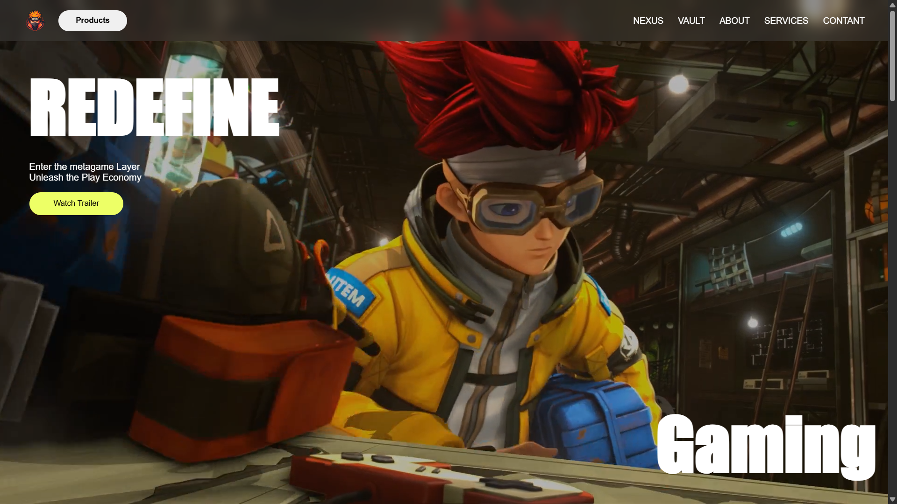
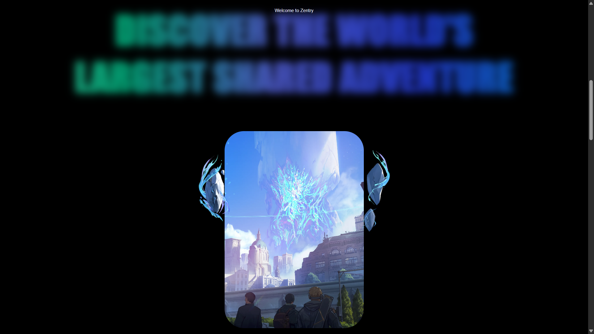

# Nova Gaming 🎮

Nova Gaming is a futuristic web app built for gamers and Web3 enthusiasts, providing a platform to explore metagames, socialize, and experience the next era of digital interaction.

This is the frontend repository.
The app is built using HTML, CSS, and JavaScript with assets such as videos and images for immersive UI/UX.

Live Deployment: Nova Gaming on Netlify 🚀

## Features

🚀 Hero Section with Background Videos
🎮 Info Cards with Auto-playing Feature Clips
🌐 Cross-platform Metagame Showcase
📷 Animated Image and Video Sections✉️ Contact and Join Us Section
🔗 Social Media Footer Integration
💻 Fully Responsive Design

## Running Locally

1. At the root of your machine, open terminal and run:

```bash
git clone https://github.com/nilanshukumarsingh/NovaGaming.git
```
2. Move into the project directory:

```bash
cd NovaGaming
```
Open the index.html file in your browser manually, or use Live Server (recommended).
There are no external dependencies to install.

## Folder Structure

```bash
NovaGaming/
│
├── img/          // All image assets
├── videos/       // All video assets
├── style.css     // Main stylesheet
├── app.js        // JavaScript file
└── index.html    // Main HTML file
```

## Screenshots

### HOME



### About Section



### Info Cards


### Contact


## Contributing

We welcome contributions!
If you would like to contribute:

```bash
# Fork the repo
# Clone your fork
git clone https://github.com/your-username/NovaGaming.git

# Create a new branch
git checkout -b feature/your-feature-name

# Make changes, then commit
git add .
git commit -m "Added [feature name]"

# Push to your fork
git push origin feature/your-feature-name

# Create a Pull Request
```

**NOTE: This project was originally created by others. However, contributions are welcome and encouraged! Feel free to improve and enhance this repository.**
